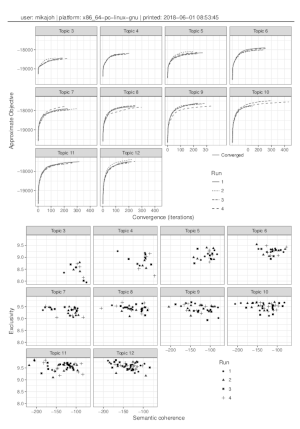

<!-- README.md is generated from README.Rmd. Please edit that file -->

## stmprinter: Print multiple [stm](http://www.structuraltopicmodel.com/) model dashboards to a pdf file for inspection

[](https://travis-ci.org/)
[](https://ci.appveyor.com/project/mikaelpoul/stmprinter)
[](https://raw.githubusercontent.com/mikajoh/stmprinter/master/LICENSE)

Estimate multiple [stm](http://www.structuraltopicmodel.com/) models and
print a dashboard for each run in separate pdf pages for inspection.
These function are designed for working with 15 or less number of topics
(such as with survey data) and can be particularly useful when it is
difficult to find a qualitiative good model on the first run.

The package includes two main
functions:

| Function         | Explanation                                                                                                                                                                                                                                                          |
| :--------------- | :------------------------------------------------------------------------------------------------------------------------------------------------------------------------------------------------------------------------------------------------------------------- |
| `many_models()`  | Runs `stm::selectModel()` for all provided K number of topics (in parallel). Unlike `stm::manyTopics` it keeps all runs kept by `stm::selectModel()` for K number of topics.                                                                                         |
| `print_models()` | Prints all runs produced by either `many_models()` or `stm::manyTopics()` into a pdf file. The file makes it easy to look through several runs for several number of topics manually. Does not work well if you have more than 15 topics. An example is shown below. |

 

### Installation

You can install `stmprinter` from github with:

``` r
# install.packages("devtools")
devtools::install_github("mikajoh/stmprinter")
```

### Example

Here is an example with the `gadarian` data that is included with the
`stm` package.

First let’s prep the data as usual with `stm::textProcessor()` and
`stm::prepDocuments()`.

``` r
library(stm)
library(stmprinter)

processed <- textProcessor(
  documents = gadarian$open.ended.response,
  metadata = gadarian
)
#> Building corpus... 
#> Converting to Lower Case... 
#> Removing punctuation... 
#> Removing stopwords... 
#> Removing numbers... 
#> Stemming... 
#> Creating Output...

out <- prepDocuments(
  documents = processed$documents,
  vocab = processed$vocab,
  meta = processed$meta
)
#> Removing 640 of 1102 terms (640 of 3789 tokens) due to frequency 
#> Your corpus now has 341 documents, 462 terms and 3149 tokens.
```

We can then run the `many_models()` function included in this package
for several K topics. It runs `stm::selectModel()` for several K topics
(in parallel) and returns a list with the output. This is convenient if
you wish to estimate several models, but unlike with `stm::manyTopics()`
(which only keeps one model per K number of topics), you wish to keep
several runs per K number of topic. Note though that the
`print_models()` function is also compatiable with output from
`manyTopics()`.

`many_model()` takes the same arguments as `stm::selectModel()` with the
exception for `K` and `cores`. Here, `K` should be vector representing
*all* the desired number of topics to run  for. The `cores` argument
lets you choose how many cores to use (defaults to the amount of cores
available on the machine).

With our `gadarian` example, we could run the following to estimate stm
models for 3 to 13 number of topics.

``` r
set.seed(2018)

stm_models <- many_models(
  documents = out$documents,
  vocab= out$vocab,
  K = 3:12,
  prevalence = ~ treatment + s(pid_rep), 
  data = out$meta,
  N = 4,
  runs = 100
)
```

You can then print all N runs for each of the provided K topics using
`print_models()` with following code.

Here, `stm_models` must either be the output from `many_model()` or
`stm::manyTopics()`. The second argument is the texts to use for
printing the most represantative text (see `?stm::findThoughts()`). You
can also provide the file name (`file`) and title at the top of the
first page (`title`).

``` r
print_models(
  stm_models, gadarian$open.ended.response,
  file = "gadarian_stm_runs.pdf",
  title = "gadarian project"
)
```

An example of the output is shown below

Note that the `text` argument is the full text responses, but
corresponding to the documents in `out$documents` (see
`?stm::findThoughts`). *If* documents is removed during
`stm::textProcessor` or `stm::prepDocuments`, you will need to remove
the same texts from the original. You can typically do that with the
following
code.

``` r
text <- gadarian$open.ended.response[-c(as.integer(processed$docs.removed))][-c(as.integer(out$docs.removed))]
```

### The `print_models()` output explained.

-----

Pull requests, questions, suggestions, etc., are welcome\!
